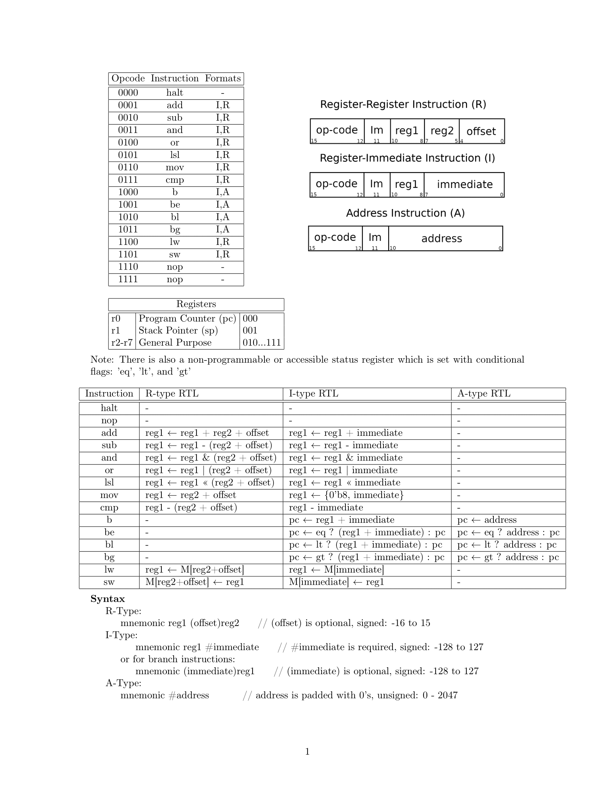

### ISA Overview



### Assembler Instructions
```
python3 assembler.py [input file] <optional 'N'>
```
It will always output to program.txt, this is then read by the testbench.
If 'N' is present, output will be surpressed.

### Assembler Features

Has support for line comments prefixed with '/', and any text after the instruction is ignored.
Has support for labels, but they must be attached to the same line as an instruction.
Has support for an optional data section. If not desired, just write program as normal. To use a data section you must specify a 'start' tag at the program entry point.
Because of this data section, the first instruction of the output will always be a branch to the start tag, default start = 1 so specifying is not required.

Example Program:
```
// program to demonstrate all instruction functionality, run for ~ 600 ns to ensure completion
Array       45
            16
            17
            18
           -56

start       mov r2 #Array   // r2 = &Array[0]
            lw  r2 r2       // r2 = Array[0] = 45
            add r2 #8       // r2 = 45 + 8 = 53
            sub r2 #8       // r2 = 45
            or  r2 #53      // r2 = 45 | 53 = 61
            and r2 #10      // r2 = 61 & 10 = 8

            mov r3 #18      // r3 = 18 = 0x0012
            lsl r3 #8       // r3 = 0x1200
            or  r3 #52      // r3 = 0x1200 | 0x0034 = 0x1234 = 4660

            cmp r2 r3
            bl  (2)pc
            nop             // nop is skipped
            
            cmp r3 r2
            bg  (2)pc
            nop             // nop is skipped

            cmp r2 #8
            be  (2)pc
            nop             // nop is skipped

            b   #done
            nop             // nops are skipped
            nop

done        sw  r2 #Array   // Array[0] = 8

            nop             // prefixed by 2 nops to show difference with halt
            nop
            halt

```
Assembler Output:
```
1000_0_00000000110
0000000000101101
0000000000010000
0000000000010001
0000000000010010
1111111111001000
0110_1_010_00000001
1100_0_010_010_00000
0001_1_010_00001000
0010_1_010_00001000
0100_1_010_00110101
0011_1_010_00001010
0110_1_011_00010010
0101_1_011_00001000
0100_1_011_00110100
0111_0_010_011_00000
1010_1_000_00000010
1110000000000000
0111_0_011_010_00000
1011_1_000_00000010
1110000000000000
0111_1_010_00001000
1001_1_000_00000010
1110000000000000
1000_0_00000011011
1110000000000000
1110000000000000
1101_1_010_00000001
1110000000000000
1110000000000000
0000000000000000
```
